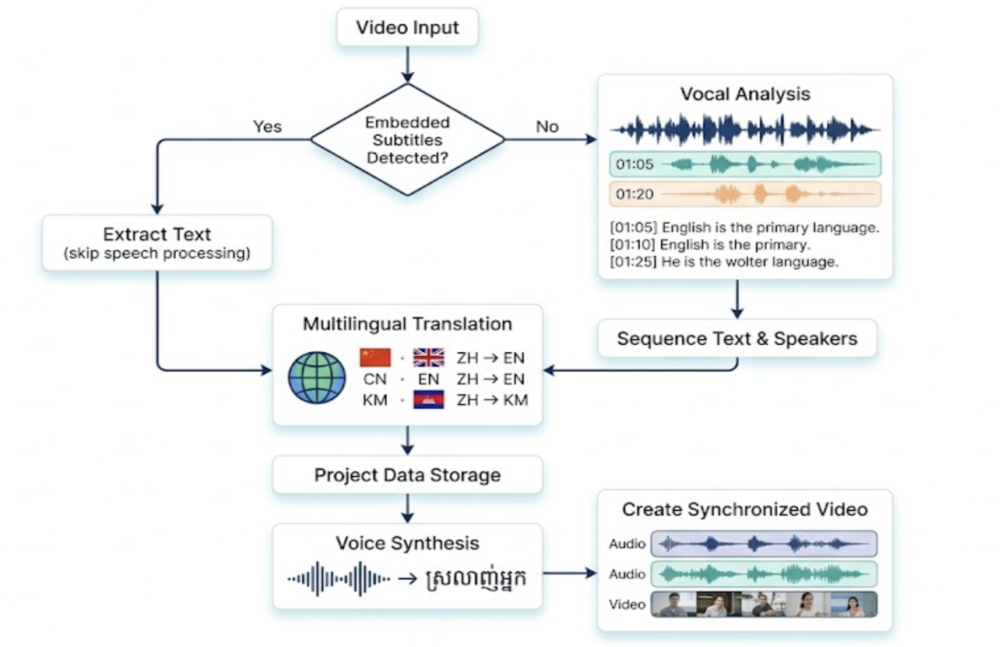

# Dubify Studio

An AI-powered movie dubbing platform that translates and dubs any films from original languages into another language, e.g. China to Khmer (and other languages). Upload a video, get back a fully translated script with speaker-attributed segments ready for voice synthesis.

---

## What it does

Dubify Studio automates the most painful parts of movie dubbing:

1. **Uploads**: a video file (`.mp4`, `.mkv`, etc.)
2. **Detects**: embedded subtitle tracks automatically, uses them if found (more accurate), falls back to AI speech recognition if subtitle tracks not found. 
3. **Diarizes**: speakers identifies who is talking at each moment using pyannoteAI
4. **Transcribes**: speech to text using via pyannoteAI combined diarize+transcribe API
5. **Translates**: each line to a desire language using any LLMs, e.g. latest google ai models with full conversation context, natural, emotional, dubbing-quality output. 
6. **Synthesizes**: voice synthesis using VoXCPM2, the latest production grade TTS models, supports zero-shot voice cloing, and cross-lingual-zero-shot voice cloning, which will improve the actor speaking quality like a real native speakers of the desirer language.

---

### Tech stack

| Component | Technology |
|---|---|
| Framework | FastAPI (Python 3.11+) |
| Database |PostgreSQL (production) |
| ORM | SQLAlchemy async |
| Speaker diarization | pyannoteAI|
| ASR | pyannoteAI Whisper large-v3-turbo|
| Subtitle extraction | ffmpeg |
| Translation | Google Latest Models with conversation context |
| TTS | VoxCPM2|
| Audio mixing | ffmpeg |

### Pipeline



### Setup

```bash
cd backend

# Create virtual environment
python3 -m venv venv
source venv/bin/activate

# Install dependencies
pip install -r requirements.txt

# Install ffmpeg (required for audio/subtitle extraction)
brew install ffmpeg        # macOS
# apt install ffmpeg       # Ubuntu

# Configure environment
cp .env.example .env
# Edit .env with your API keys

# Run server
uvicorn app.main:app --reload
```

Open `http://localhost:8000/docs` for the interactive Swagger UI.


### API endpoints

| Method | Endpoint | Description |
|---|---|---|
| GET | `/health` | Service health check |
| POST | `/api/v1/projects/` | Create project |
| GET | `/api/v1/projects/` | List all projects |
| DELETE | `/api/v1/projects/{id}` | Delete project |
| POST | `/api/v1/jobs/upload/{project_id}` | Upload video (auto-detects subtitles) |
| POST | `/api/v1/jobs/upload-subtitle/{project_id}` | Upload video + separate subtitle file |
| GET | `/api/v1/jobs/{job_id}` | Poll job status and progress |
| GET | `/api/v1/jobs/{job_id}/subtitle-tracks` | List subtitle tracks in video |
| GET | `/api/v1/jobs/{job_id}/segments` | Get all transcript segments |
| PATCH | `/api/v1/segments/{id}` | Edit segment text |
| POST | `/api/v1/segments/{id}/approve` | Approve segment for TTS |
| POST | `/api/v1/jobs/{job_id}/approve-all` | Approve all segments |
| GET | `/api/v1/projects/{id}/speakers` | List detected speakers |
| PATCH | `/api/v1/speakers/{id}` | Edit speaker voice profile |
| POST | `/api/v1/tts/synthesize/job/{job_id}` | Synthesize all approved segments |
| POST | `/api/v1/tts/mix/{job_id}` | Mix TTS audio into final video |

### Run tests

```bash
pytest tests/ -v
```

### Backend folder structure

```
backend/
├── app/
│   ├── main.py
│   ├── core/
│   │   ├── config.py             All settings from .env
│   │   └── database.py           SQLAlchemy async engine
│   ├── models/models.py          DB tables: Project, Job, Speaker, Segment
│   ├── schemas/schemas.py        Pydantic request/response schemas
│   ├── services/
│   │   ├── audio_extractor.py    ffmpeg: extract audio + subtitles
│   │   ├── subtitle_parser.py    SRT/ASS subtitle parser
│   │   ├── diarizer.py           pyannoteAI diarization + ASR
│   │   ├── translator.py         Gemini translation with context
│   │   ├── tts_client.py         VoxCPM2 HTTP client
│   │   ├── pipeline.py           ASR pipeline orchestrator
│   │   └── subtitle_pipeline.py  Subtitle pipeline orchestrator
│   └── api/routes/
│       ├── health.py
│       ├── projects.py
│       ├── jobs.py
│       ├── segments.py
│       └── tts.py
├── tests/test_api.py
├── requirements.txt
└── .env.example
```

---

## Frontend

### Tech stack

| Component | Technology |
|---|---|
| Framework | React 19 + TypeScript |
| Build tool | Vite 8 |
| Styling | Tailwind CSS v3 |
| Routing | React Router v7 |
| HTTP client | Axios |
| Data fetching | TanStack Query v5 |
| Global state | Zustand v5 |

### Setup

```bash
cd frontend

npm install
npm run dev
```

Open `http://localhost:5173`. Vite proxies all `/api` requests to the backend at `localhost:8000` automatically — run both servers simultaneously.

```bash
npm run build    # production build
npm run preview  # preview production build locally
```

### Frontend folder structure

```
frontend/
├── src/
│   ├── api/client.ts       Axios API client — all backend calls
│   ├── hooks/useApi.ts     TanStack Query hooks for every endpoint
│   ├── store/index.ts      Zustand global state
│   ├── types/index.ts      TypeScript types matching backend schemas
│   ├── components/         Shared UI components
│   ├── pages/              Page components
│   ├── lib/                Utility functions
│   ├── App.tsx             Router setup
│   └── main.tsx            Entry point
├── vite.config.ts          Proxy + path aliases
├── tailwind.config.js
└── tsconfig.json
```

### Planned pages

| Route | Page |
|---|---|
| `/projects` | Projects dashboard — list, create, delete |
| `/projects/:id` | Project detail — jobs list, upload video |
| `/projects/:id/jobs/:jobId` | Script editor — review segments, approve for TTS |

---

## Supported languages

Officially supports 30 languages including:

Arabic, Burmese, Chinese, Danish, Dutch, English, Finnish, French, German, Greek, Hebrew, Hindi, Indonesian, Italian, Japanese, **Khmer**, Korean, Lao, Malay, Norwegian, Polish, Portuguese, Russian, Spanish, Swahili, Swedish, Tagalog, Thai, Turkish, Vietnamese

---

## Requirements

| Requirement | Minimum |
|---|---|
| Python | 3.11+ |
| Node.js | 18+ |
| ffmpeg | Any recent version |
| RAM | 8GB|
| GPU | NVIDIA 8GB+ VRAM (cloud only) |

---

## License

Private — all rights reserved.
