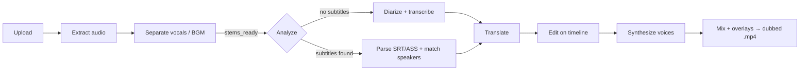

# Dubify Studio

AI movie dubbing in a single window — translate and re-voice a film from its original language into another (built for **Chinese → Khmer**), then export the dubbed `.mp4`.

All AI runs **in the cloud over HTTPS** — Hugging Face Spaces and Google AI Studio. Locally it's just FastAPI, ffmpeg, and a React editor: no GPU, no local models.

---

## How it works

The entire app is one CapCut-style editor window. An icon rail on the left switches the dock panel between **Projects · Sessions · Speakers · Elements · Voices · Settings**; the video player, transcript inspector, and timeline stay in place.

1. **Import** a video into a project. Stage 1 runs automatically: audio extraction → vocal/BGM separation. Embedded subtitle tracks are auto-detected and preferred over speech recognition.
2. **Analyze** (one click) — Stage 2: speaker diarization + transcription in a single MOSS HF Space call (skipped when subtitles exist), then batched Gemini translation with full scene context.
3. **Edit** on the timeline: drag, trim, and split clips; fix translations in the transcript; assign voices per speaker or per segment; adjust volume/filter/speed per clip. Timeline and transcript edits are undoable (⌘Z).
4. **Generate voices** with VoxCPM2 — voice design, cloning, or clip+transcript "ultimate" cloning — per segment, per selection, or per job.
5. **Export**: ffmpeg mixes the TTS clips with the clean BGM stem, burns in overlays (logo, Khmer subtitles, cover boxes), and saves the `.mp4` to a destination you choose.


```mermaid
flowchart LR
    A[Upload] --> B[Extract audio]
    B --> C[Separate vocals / BGM]
    C -->|stems_ready| D{Analyze}
    D -->|no subtitles| E[Diarize + transcribe]
    D -->|subtitles found| F[Parse SRT/ASS + match speakers]
    E --> G[Translate]
    F --> G
    G --> H[Edit on timeline]
    H --> I[Synthesize voices]
    I --> J[Mix + overlays → dubbed .mp4]
```

Every cloud dependency degrades gracefully (configured backend → free public Space → mock), so the full flow runs end-to-end with **zero API keys** for testing.

---

## Tech stack

| Component | Technology |
|---|---|
| Backend | FastAPI (Python 3.11+), async SQLAlchemy |
| Database | SQLite (dev) / PostgreSQL·Neon (production) |
| Diarization + ASR | MOSS HF Space (`OpenMOSS-Team/MOSS-transcribe-diarize`, combined, one call) |
| Vocal separation | BS-RoFormer / Mel-RoFormer via HF Space |
| Translation | Gemini (Google AI Studio), batched with scene context; deep-translator fallback |
| TTS | VoxCPM2 via Gradio app or public HF Space; Gemini TTS fallback |
| Audio/video processing | ffmpeg |
| Frontend | React 19 + TypeScript, Vite, Tailwind CSS, TanStack Query v5, Zustand v5 |
| Desktop | Tauri 2 (backend bundled as a PyInstaller sidecar) |

---

## Getting started

### Backend

```bash
cd backend

python3 -m venv venv
source venv/bin/activate
pip install -r requirements.txt

# ffmpeg is required for all audio/video processing
brew install ffmpeg        # macOS
# apt install ffmpeg       # Ubuntu

# Configure environment (all keys optional — mock mode works without any)
cp .env.example .env

uvicorn app.main:app --reload
```

Swagger UI at `http://localhost:8000/docs`. See [backend/README.md](backend/README.md) for the API, services, and environment reference.

### Frontend

```bash
cd frontend
npm install
npm run dev        # http://localhost:5173 — proxies /api, /health, /uploads to the backend
```

Run both servers together; the Vite proxy handles all backend calls. See [frontend/README.md](frontend/README.md) for the editor architecture.

### Desktop (Tauri)

```bash
cd backend && ./build_sidecar.sh    # PyInstaller sidecar → frontend/src-tauri/binaries/
cd frontend && npm run tauri build  # → .app + .dmg (Apple Silicon)
```

Rebuild the sidecar after backend **or** frontend changes — it bundles `frontend/dist` and `backend/.env` into the binary.

### Tests

```bash
cd backend && pytest app/tests/ -v
```

---

## Configuration

All settings live in `backend/app/core/config.py`, loaded from `backend/.env`. The key ones:

| Variable | Description |
|---|---|
| `GEMINI_API_KEY` | Google AI Studio key — translation + Gemini TTS fallback (free at aistudio.google.com) |
| `VOXCPM2_API_URL` | Gradio app URL running VoxCPM (e.g. a Colab `gradio.live` URL); blank → public HF Space |
| `SEPARATION_HF_MODEL` | `BS-RoFormer` \| `Mel-RoFormer` \| `HTDemucs-FT` |
| `HF_TOKEN` | Optional — raises HF rate limits for the separation/diarization Spaces |
| `DATABASE_URL` | Blank → local SQLite; `postgresql+asyncpg://…` for Neon/Postgres |

## Languages

The product targets **Chinese → Khmer** and the UI ships that pair. The translation layer also recognises English, Korean, Japanese, Thai, Vietnamese, French, and German — other pairs work by extending `LANGUAGE_OPTIONS` (frontend) and `LANG_NAMES` (backend translator).

---

## Requirements

| Requirement | Minimum |
|---|---|
| Python | 3.11+ |
| Node.js | 18+ |
| ffmpeg | Any recent version, on `PATH` |
| RAM | 8 GB |
| GPU | None — all inference is cloud-hosted |

## Known limitations

- The desktop build currently targets **macOS Apple Silicon** only, and the sidecar embeds `backend/.env` (API keys + machine-specific paths) — built binaries are personal; don't distribute them.
- Burned-in subtitles render with Noto Sans Khmer, which has **no Latin glyphs** — Khmer, digits, and punctuation render; Latin letters inside a line are dropped.
- Subtitle sizing is deliberately automatic: you set the font size and the text-column width, and each line's block grows upward from a fixed bottom anchor. There's no manual box height — a single hand-drawn rectangle can't fit every segment's translation.
- The "spk" max-speakers input next to Analyze is accepted but ignored (the MOSS Space has no speaker-count parameter).

## License

Private — all rights reserved.
